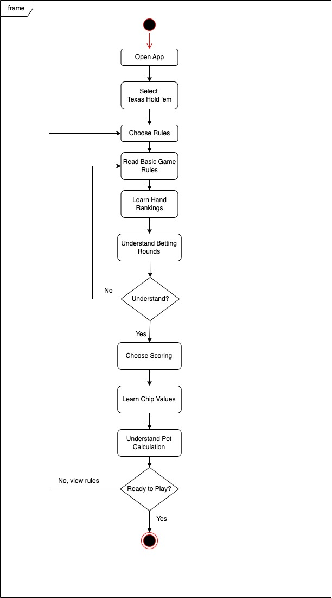
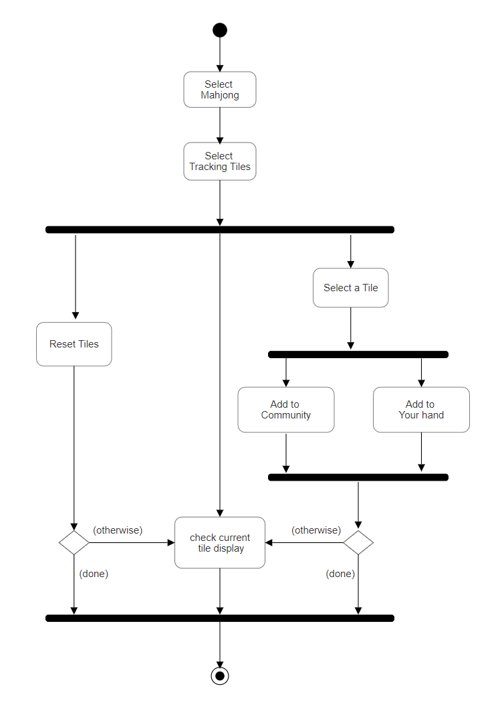

# Specification Phase Exercise

A little exercise to get started with the specification phase of the software development lifecycle. See the [instructions](instructions.md) for more detail.

## Team members

Elaine Lyu: https://github.com/ElaineR02     
Linda Li: https://github.com/Applejam-ovo     
Hannah Liang: https://github.com/HannahLiang627      
Rita He: https://github.com/ritaziruihe

## Stakeholders

**Name: Isi Fang**     
Goals/needs: 
- clear game rules can be found
- help scoring
- contain various types of games (mahjong from different regions, texas hold’em, etc)
- Record cards  
   
Problems/frustrations: 
- Unclear about game rules
- don’t know how to score
- Want to calculate what cards haven’t been played but hard to remember
- Sometimes players have disagreements upon the game rule, even they are playing the same game from the same region

**Name: Sammi Cui**  
Goals/needs: 
- Able to distinguish between Mahjong rules from different regions
- Help scoring
- Easy to teach new hand
- Set a clear standard for rules

Problems/frustrations: 
- people from different have different ways of playing mahjong
- time consuming to spend time determining and teaching how to play
- card scoring calculation rules are vague and time consuming
- card scoring calculation difference could cause conflicts between friends

## Product Vision Statement

A tool acts as a helper for board game players to better understand rules, card counting and scoring , and succeed in the Mahjong and cards.

## User Requirements

1. As a new Texas hold ’em player, I want clear game rules and scoring rules so that I can understand the game in a short time and figure out how to play the game.
2. As a Szechuan Mahjong player who wants to play Hangzhou Mahjong with new friends, I want to know the difference between the playing rules and scoring methods between these two kinds of Mahjong, so that I can get familiar with Hangzhou Mahjong quickly and win the game.
3. As a new Texas Hold 'em player, I want a tool that helps me understand the betting rounds and strategies, so that I can make smarter bets and improve my chances of winning.
4. As a Chinese international student, I want to be involved in the Mahjong parties so that I can make new friends, but I am always too shy to ask for help with rules and scoring.
5. As an American-born Asian, I always see my family members playing Mahjong, but I'm so unskilled at it, I often forget that the card I want has already been dealt. I need help in tracking the state of affairs and getting a better chance in winning!
6. I play Mahjong almost every week, and I am tired and bored of the rules and tricks that I am already too familiar with! I want to know the Mahjong rules that I don’t know and try that with my Mahjong-mates.
7. As a player in a new card game, I want a way to review the game rules mid-play so that I can avoid making mistakes during the game.
8. As a Chinese international student hosting a party, I want to introduce my friends to card games and Mahjong using simple game guides and interactive tutorials, so that everyone can quickly learn and enjoy the games.
9. As an experienced card player, I want an automated score tracker so that I can focus more on gameplay and less on manual score calculations.
10. As a Chinese student playing Mahjong with friends from different regions, I want to quickly provide a comparison of regional rule variations so that we can agree on one set of rules to play without confusion.

## Activity Diagrams

user story:     
As a new Texas hold ’em player, I want clear game rules and scoring rules so that I can understand the game in a short time and figure out how to play the game.      

user story:
As an American-born Asian, I always see my family members playing Mahjong, but I'm so unskilled at it, I often forget that the card I want has already been dealt. I need help in tracking the state of affairs and getting a better chance in winning!

## Clickable Prototype 
Link: https://www.figma.com/proto/hSei4vH2WDLJO4FqNnxhWR/Board-Game-Wireframe?node-id=5-5&node-type=frame&t=vNiWtVipvMruouh0-0&scaling=scale-down&content-scaling=fixed&page-id=0%3A1&starting-point-node-id=5%3A5 